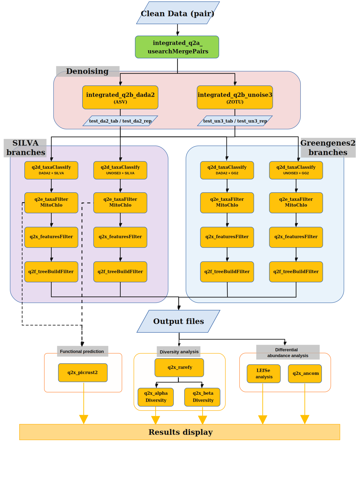

# DualTax16S

## Introduction

This repository provides an integrated 16S rRNA amplicon sequencing analysis pipeline based on QIIME2, USEARCH, SILVA, Greengenes2, LEfSe and PICRUSt2.

It is designed for reproducible microbiome analysis from paired-end FASTQ files to taxonomic profiling, diversity analysis, differential abundance analysis and optional functional prediction.
## Workflow



## Main Features

- Paired-end read merging using USEARCH.
- Denoising with DADA2 and UNOISE3.
- Taxonomic classification using SILVA and Greengenes2.
- Removal of mitochondrial and chloroplast features.
- Feature filtering, tree construction and rarefaction.
- Alpha and beta diversity analysis.
- Differential abundance analysis using ANCOM and LEfSe.
- Optional PICRUSt2 functional prediction.

## Environment Requirements

This pipeline was developed and tested on CentOS 7 with QIIME2 2022.2.

Required software:

- QIIME2
- USEARCH
- PICRUSt2
- LEfSe
- R

## Quick Start

Clone the repository:

```bash
git clone https://github.com/your_name/your_repo.git
cd your_repo
```

Prepare the input files in `scripts/`. The current runner uses `scripts/` as the
working directory, so the pipeline expects these files there:

```text
scripts/${prefix}_seq/
scripts/${prefix}_manifest.tsv
scripts/${metadata_file}
```

Edit the integrated configuration file before running:

```bash
vim config/configuration_integrated.txt
```

At minimum, update these required settings:

```text
prefix=your_project_prefix
region=V3V4
metadata_file=sample_metadata.tsv
usearch_command=/path/to/usearch
```

The `prefix` must match the input names. For example, if `prefix=test`, the
pipeline expects:

```text
scripts/test_seq/
scripts/test_manifest.tsv
```

The `metadata_file` must contain sample IDs matching the manifest and FASTQ file
prefixes. The column named by `investigate_group` is used for beta diversity,
ANCOM, LEfSe, and optional sample grouping.

Also adjust these dataset-dependent parameters before a formal run:

```text
min_samples=2
min_frequency=8
dada2_sampleDepth=9700
dada2_sampleDepthTree=9700
unoise3_sampleDepth=34500
unoise3_sampleDepthTree=34500
```

If you want to filter samples by a metadata grouping column before downstream
diversity and differential-abundance steps, configure:

```text
data_group_column=
data_group_where=
data_group_suffix=grouped
```

Run the pipeline after activating the required QIIME2/USEARCH/PICRUSt2/LEfSe
environment:

```bash
bash scripts/run_integrated_dualdb.batch
```

Per-step runtime is recorded in `scripts/integrated_pipeline_timing_*.tsv`.
## Example Dataset

A lightweight example dataset is provided in the example/ directory for pipeline validation and demonstration.

The dataset was subsampled from the publicly available 16S rRNA amplicon sequencing dataset associated with the study:

**Differential roles of the fish chitinous membrane in gut barrier immunity and digestive compartments**

BioProject: **PRJNA798186**

To reduce repository size and runtime requirements, only six samples (three WT samples and three mutant samples) were retained from the original dataset. The example dataset contains paired-end sequencing reads (12 FASTQ files in total) and is intended solely for testing pipeline functionality and reproducibility.

Sample metadata, manifest files, and representative analysis results are included to allow users to validate their software environment and verify successful pipeline execution.

## Options

Optional steps can be turned on or off in `scripts/run_integrated_dualdb.batch`.

To filter samples by a metadata group before rarefaction, diversity analysis,
ANCOM and LEfSe, uncomment:

```bash
run_step integrated_q2x_dataGroup.batch
```

The filtering rule is set in `config/configuration_integrated.txt`:

```text
data_group_column=
data_group_where=
data_group_suffix=grouped
```

PICRUSt2, ANCOM and LEfSe are enabled by default. Comment out the corresponding
`run_step` line in the runner if you do not need one of them.

## Citation

- Bolyen E, Rideout JR, Dillon MR, Bokulich NA, Abnet CC, Al-Ghalith GA, Alexander H, Alm EJ, Arumugam M, Asnicar F, Bai Y, Bisanz JE, Bittinger K, Brejnrod A, Brislawn CJ, Brown CT, Callahan BJ, Caraballo-Rodríguez AM, Chase J, Cope EK, Da Silva R, Diener C, Dorrestein PC, Douglas GM, Durall DM, Duvallet C, Edwardson CF, Ernst M, Estaki M, Fouquier J, Gauglitz JM, Gibbons SM, Gibson DL, Gonzalez A, Gorlick K, Guo J, Hillmann B, Holmes S, Holste H, Huttenhower C, Huttley GA, Janssen S, Jarmusch AK, Jiang L, Kaehler BD, Kang KB, Keefe CR, Keim P, Kelley ST, Knights D, Koester I, Kosciolek T, Kreps J, Langille MGI, Lee J, Ley R, Liu YX, Loftfield E, Lozupone C, Maher M, Marotz C, Martin BD, McDonald D, McIver LJ, Melnik AV, Metcalf JL, Morgan SC, Morton JT, Naimey AT, Navas-Molina JA, Nothias LF, Orchanian SB, Pearson T, Peoples SL, Petras D, Preuss ML, Pruesse E, Rasmussen LB, Rivers A, Robeson MS, Rosenthal P, Segata N, Shaffer M, Shiffer A, Sinha R, Song SJ, Spear JR, Swafford AD, Thompson LR, Torres PJ, Trinh P, Tripathi A, Turnbaugh PJ, Ul-Hasan S, van der Hooft JJJ, Vargas F, Vázquez-Baeza Y, Vogtmann E, von Hippel M, Walters W, Wan Y, Wang M, Warren J, Weber KC, Williamson CHD, Willis AD, Xu ZZ, Zaneveld JR, Zhang Y, Zhu Q, Knight R, and Caporaso JG. 2019. Reproducible, interactive, scalable and extensible microbiome data science using QIIME 2. Nature Biotechnology 37: 852–857. https://doi.org/10.1038/s41587-019-0209-9
- R.C. Edgar (2010), Search and clustering orders of magnitude faster than BLAST, Bioinformatics 26(19) 2460-2461
- Yue, Z., Fan, Z., Zhang, H. et al. Differential roles of the fish chitinous membrane in gut barrier immunity and digestive compartments. EMBO Rep 24, EMBR202256645 (2023). 
- McDonald, D., Jiang, Y., Balaban, M. et al. Greengenes2 unifies microbial data in a single reference tree. Nat Biotechnol 42, 715–718 (2024).
- Douglas, G.M., Maffei, V.J., Zaneveld, J.R. et al. PICRUSt2 for prediction of metagenome functions. Nat Biotechnol 38, 685–688 (2020). 
- 
- ## Roadmap

Planned future improvements:

- [ ] Parallelized workflow execution
- [ ] Automated PICRUSt2 visualization
- [ ] Additional differential abundance methods (e.g. LinDA)
- [ ] Improved input/output directory structure

## Contact
If you encounter any question during the use of this pipeline, please contact us by email jiangxy263@mail2.sysu.edu.cn